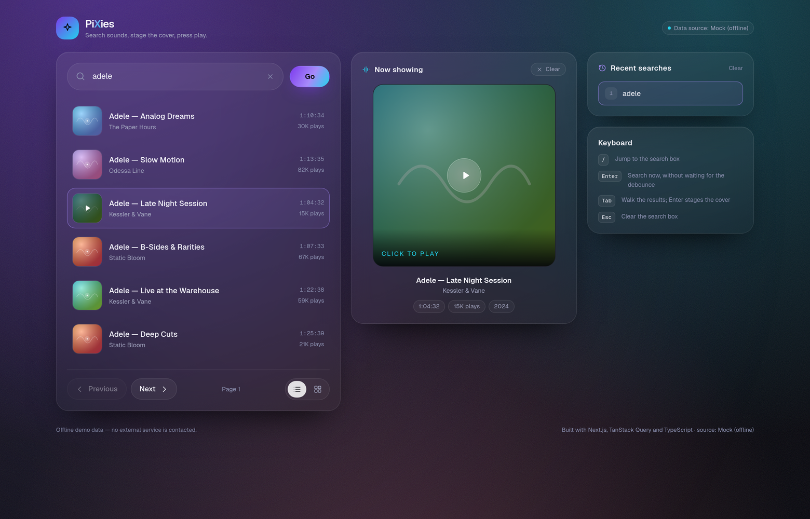
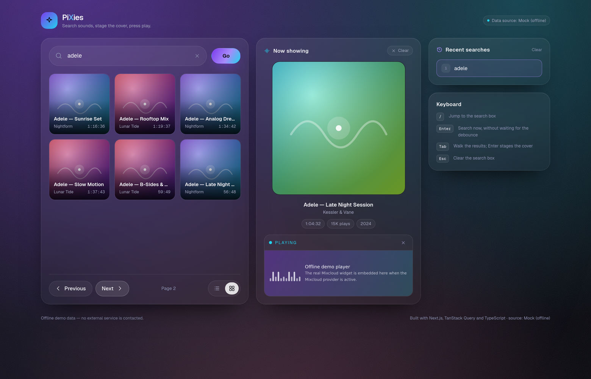
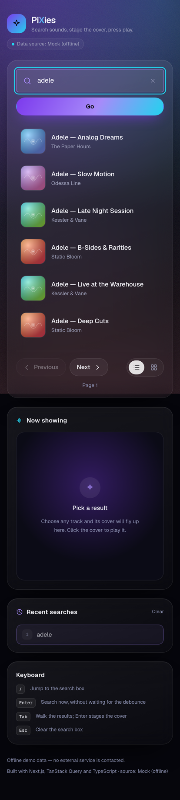

# PiXies — sound search

**Live app: `https://<your-deployment>.vercel.app`** ← _replace this line with your deployment URL before submitting (see [Deployment](#deployment), it takes about two minutes)._

Repository: `https://github.com/<you>/pixies`

Search a sound library, watch the cover of a result fly into the image stage, and click it to play the track — built with **Next.js (App Router) + TypeScript + TanStack Query**, on top of the **Mixcloud API**.



| Tile view + page 2                        | Mobile                                      |
| ----------------------------------------- | ------------------------------------------- |
|    |        |

---

## Quick start

```bash
npm install
npm run dev            # http://localhost:3000 — talks to the real Mixcloud API
```

Other scripts:

| Script                | What it does                                                            |
| --------------------- | ----------------------------------------------------------------------- |
| `npm run dev:mock`    | Same app, offline demo provider — no external calls (great for demos/CI) |
| `npm run build`       | Production build                                                        |
| `npm start`           | Serve the production build                                              |
| `npm test`            | Vitest unit/component tests (57 tests)                                   |
| `npm run typecheck`   | `tsc --noEmit`                                                          |
| `npm run lint`        | ESLint                                                                  |
| `npm run verify`      | typecheck + lint + tests, in one go                                     |

No API key is required — Mixcloud's public search endpoint is open. The only configuration is `SOUND_PROVIDER` (see `.env.example`):

```bash
SOUND_PROVIDER=mixcloud   # default
SOUND_PROVIDER=mock       # offline demo data
```

In mock mode a few terms drive the edge cases on purpose: anything containing `zzz` returns no results, and anything containing `boom` fails so you can see the error + retry state.

---

## Architecture

The brief asked for layers that can change independently, so the code is split by **responsibility**, not by file type:

```
src/
├─ lib/
│  ├─ domain/         Track, TrackPage, SearchError — the vocabulary of the app
│  ├─ providers/      DATA LAYER (server side)
│  │   ├─ types.ts        SoundProvider port: search() + isValidCursor()
│  │   ├─ mixcloud/       adapter: raw Mixcloud payload → domain model
│  │   ├─ mock/           adapter: deterministic offline data
│  │   └─ registry.ts     picks the active provider from SOUND_PROVIDER
│  ├─ api/            DATA LAYER (browser side): typed client + wire contract
│  ├─ core/           PURE LOGIC: history rules, cursor pagination, storage, formatting
│  └─ ui/             fly-to-stage animation helper (DOM only, no React)
├─ hooks/             STATE LAYER: useTrackSearch, useSearchHistory, useViewMode, …
├─ components/        VIEW LAYER: presentational components + one container
└─ app/               Next.js routes: page.tsx (server) + api/tracks/search/route.ts
```

### The three layers and the rules between them

**1. Data layer — `lib/providers` + `app/api/tracks/search` + `lib/api`.**
Every provider implements one small port:

```ts
interface SoundProvider {
  id: string;
  label: string;
  search(options: { term: string; limit: number; cursor?: string | null; signal?: AbortSignal }): Promise<TrackPage>;
  isValidCursor(cursor: string): boolean;
}
```

Provider payloads never leave this layer: the Mixcloud adapter maps `cloudcast` objects into `Track`, picks the best artwork, drops unrenderable entries, and builds the embed URL. The browser talks only to **our own** `/api/tracks/search` route, which asks the configured provider.

**Swapping the sound API** therefore means: add `lib/providers/<name>/index.ts` implementing the port, register it in `registry.ts`, set `SOUND_PROVIDER=<name>`. No component, hook, or route handler changes — the `mock` provider in this repo is that swap, done twice over.

Why route through our own endpoint rather than calling Mixcloud from the browser?

- CORS and (for providers that need them) API keys stay server-side;
- the mapping runs once, on the server, so the client ships less code;
- responses can be cached at the edge (`s-maxage=60, stale-while-revalidate=300`);
- and the client contract stays stable no matter which provider is behind it.

Cursors are the provider's own paging tokens, and they round-trip through the browser — so the route treats them as untrusted input and refuses anything the active provider does not recognise (`isValidCursor`), which stops the endpoint from being used as an open proxy.

**2. State layer — `hooks/`.**
`useTrackSearch(term)` owns "which page of which search are we showing": the cursor stack, the query, the loading/empty/error facts. `useSearchHistory` and `useViewMode` own persistence. Components receive results and callbacks; they never import the API client.

**3. View layer — `components/`.**
Every component except `SoundExplorer` is presentational: `ResultsPanel`, `ResultRow`, `ResultTile`, `PaginationBar`, `RecentSearches`, `ImageStage`, `TrackPlayer`, `StateViews`. They take data and callbacks as props and can be dropped into a different app, a Storybook story, or a test — as `ResultsPanel.test.tsx` does — without dragging any fetching with them. `SoundExplorer` is the single container: it is the only place that knows the search hook, the persistence hooks and the components all exist at once.

### Data flow of one search

```
type "adele"
  → useDebouncedValue (300 ms)
  → useTrackSearch → TanStack Query key ['tracks','search','adele',{cursor:null}]
  → searchTracks()  → GET /api/tracks/search?q=adele&limit=6
  → route handler   → getActiveProvider().search(...)   [mixcloud | mock]
  → adapter maps the payload → TrackPage
  → ResultsPanel renders list or tiles
click a result
  → flyToStage(): a ghost of the artwork flies to the image container and fades out
  → ImageStage fades the full-size cover in, focus moves to its play button
click the cover
  → TrackPlayer mounts the provider's embed under the image and it starts playing
```

---

## Async correctness

This is the part the brief cared most about, so it is worth being explicit:

- **Debounce.** The input value is debounced by 300 ms (`useDebouncedValue`). Pressing Enter or clicking **Go** bypasses the wait.
- **Cancellation.** TanStack Query passes an `AbortSignal` into `queryFn`; it travels through `searchTracks` into `fetch` and on into the route handler (`request.signal`), so a superseded search is aborted end to end.
- **No stale-response races.** The query key contains the term *and* the cursor. A response for `"ade"` that arrives after `"adele"` belongs to a different key, so it is written to a different cache entry and can never overwrite what is on screen. There is a test for exactly this (`useTrackSearch.test.tsx` — "a slow response for an old term never overwrites the current results"), which resolves the first request *after* the second one.
- **Rapid Next/Previous.** Paging is blocked while a page is in flight, by a ref (blocks several clicks fired in the same tick, which would all read the same pre-click state) plus a state flag (keeps the buttons' `disabled` in sync). The cursor stack therefore cannot run ahead of the data.
- **Paging uses the provider's cursor**, not an offset: `paging.next` from Mixcloud is remembered in a stack, so **Previous** returns to the exact cursor of the page before, and **Next** is disabled as soon as the provider stops handing one back.
- **Prefetch.** Once a page settles, the next one is prefetched, so Next usually renders instantly.

Every state is handled visibly: skeletons while loading, an empty state naming the term, an alert with a **Try again** button on failure, and `aria-busy` + one polite live region so screen-reader users hear the same transitions.

---

## State, persistence and the recent searches rules

`core/history.ts` holds the rules as pure functions: terms are trimmed and whitespace-collapsed, compared case-insensitively, re-searching an existing term **moves it to the top instead of duplicating it**, and the list is capped at five. `core/storage.ts` is the storage port — a `KeyValueStore` with a `localStorage` adapter (wrapped so Safari private mode or a full quota degrades to "forgets things" rather than "throws"), an in-memory adapter for tests, and a typed JSON layer that validates what it reads: corrupt or outdated persisted data is repaired, never crashes the app.

Hooks read this through `useSyncExternalStore`, which gives the correct server snapshot during hydration (no mismatch, no flash) and keeps two open tabs in agreement through `storage` events.

A term is remembered when the intent is clear: on submit, on clicking a recent search, on clicking a result — or when a debounced search has been sitting there with results for ~1.2 s. That last rule is a deliberate choice: recording every debounced keystroke would fill the list with prefixes (`a`, `ad`, `ade`, …).

The list/tile choice is persisted the same way and restored on the next visit.

---

## Accessibility

- Semantic structure: `header`/`main`/`section`/`footer`, one `h1`, labelled regions, results in a real `ul`/`li` with buttons, `nav` for paging.
- The whole flow is keyboard-operable: skip link → search → results → stage → player. `/` jumps to the search box, `Esc` clears it, `Enter` searches immediately.
- **Focus management for the flight**: when a result is activated, focus moves to the staged cover's play button once it has rendered — the keyboard journey follows the animation instead of being stranded in the list.
- ARIA where it earns its place: `aria-controls` from the search box and paging controls to the results region, `aria-busy` while fetching, a single polite `role="status"` region that announces "Searching…", the result count, the empty state and failures, `aria-current` on the selected result and the active recent search, `aria-pressed` on the list/tile toggle, `role="alert"` for errors.
- Visible focus rings everywhere (never removed), and `prefers-reduced-motion` disables the flight and all decorative animation.
- Verified with axe-core on four states (idle, results, playing, tiles): **no violations**. Text colours were checked manually against the translucent panels, since axe cannot compute contrast over gradients — the small helper colour was lightened to clear 4.5:1.

---

## Testing

```bash
npm test
```

57 tests, aimed at the logic rather than the pixels:

| Area                              | File                                     |
| --------------------------------- | ---------------------------------------- |
| Recent-searches rules (dedup, cap, normalisation, corrupt data) | `lib/core/history.test.ts` |
| Cursor pagination state machine   | `lib/core/pagination.test.ts`            |
| Storage port + typed/validated persistence | `lib/core/storage.test.ts`      |
| Mixcloud payload mapping + cursor sanitising | `lib/providers/mixcloud/mapper.test.ts` |
| API client: params, contract validation, error taxonomy, aborts | `lib/api/searchClient.test.ts` |
| Search hook: stale responses, page reset, rapid paging, empty/error | `hooks/useTrackSearch.test.tsx` |
| History/view-mode persistence across "visits" | `hooks/useSearchHistory.test.tsx` |
| Results view: all five states + a11y attributes | `components/ResultsPanel.test.tsx` |

---

## Deployment

The app is a standard Next.js app with one dynamic route handler, so any Node host works. Vercel is the shortest path:

**Option A — from the CLI (about two minutes):**

```bash
npm i -g vercel
vercel            # first run links the project
vercel --prod     # → https://<project>.vercel.app
```

**Option B — from GitHub:** push this repo, then on vercel.com → _Add New Project_ → import it → **Deploy**. No environment variables are required (the default provider is Mixcloud). To deploy the offline demo instead, set `SOUND_PROVIDER=mock` in Project Settings → Environment Variables.

Then put the resulting URL at the top of this README.

> Netlify (`@netlify/plugin-nextjs`), Render and Cloudflare Pages all work too. Static-only hosts (GitHub Pages) do **not**, because `/api/tracks/search` needs a server — if you must use one, point `searchClient` straight at the provider instead.

---

## Requirements checklist

| #   | Requirement                                              | Where                                                            |
| --- | -------------------------------------------------------- | ---------------------------------------------------------------- |
| 1   | Search, names listed, 6 results at a time                 | `SearchBar`, `ResultsPanel`, `PAGE_SIZE = 6`                      |
| 2   | Next/Previous by cursor, Next disabled at the end         | `core/pagination.ts`, `PaginationBar`, `useTrackSearch`           |
| 3   | Last 5 searches, persisted, no duplicates, newest first   | `core/history.ts`, `useSearchHistory`, `RecentSearches`           |
| 4   | Clicking a recent search runs it again                    | `SoundExplorer.searchFromHistory`                                 |
| 5   | Result flies to the image container, fades out, image in  | `lib/ui/fly.ts`, `ImageStage`                                     |
| 6   | Clicking the central image embeds and plays the track     | `TrackPlayer`, `embedUrl` built in the adapter                    |
| 7   | Debounce, AbortController, no stale responses, safe paging | `useDebouncedValue`, `useTrackSearch`, route handler              |
| 8   | Loading / empty / error-with-retry states                 | `StateViews`, `ResultsPanel`                                      |
| 9   | TypeScript, no `any`, core logic separate + unit tested    | `lib/core/*`, `lib/providers/*`, 57 tests                          |
| 10  | Decoupled data / UI / state layers, swappable provider     | this section + `lib/providers/types.ts`                           |
| 11  | Deployed, public URL at the top of the README              | [Deployment](#deployment)                                         |
| 12  | Tile ⇄ list toggle, remembered for next visit (bonus)      | `PaginationBar`, `useViewMode`, `ResultTile`                      |
| 13  | Accessibility (bonus)                                      | [Accessibility](#accessibility)                                   |
| 14  | Beautiful, well-structured CSS (bonus)                     | `app/globals.css` design tokens + Tailwind v4                     |

---

## Trade-offs and notes

- **Next.js over plain React + Express.** One codebase, one deploy, and the route handler gives a natural home for the data layer. The trade-off is that the app needs a Node host rather than a CDN bucket; for this feature set that is a fair price, and the provider port means the client could be pointed straight at an API if a static host were ever required.
- **TanStack Query over hand-rolled fetching.** Request cancellation, keyed caching, `keepPreviousData` and prefetching are exactly the primitives this exercise asks for; writing them by hand would be more code and more bugs.
- **Plain `` instead of `next/image`.** Artwork hostnames belong to whichever provider is configured; `next/image` would force them into `next.config.ts` and undo the point of the swappable data layer. Artwork has a gradient fallback on error.
- **The flight uses the Web Animations API, not a layout animation library.** The ghost element is measured from the real DOM, animated, then removed — no library, no layout thrash in the list, and it degrades to an instant swap under `prefers-reduced-motion`.
- **Tailwind v4 with a small token layer.** Colours, radii and animations are declared once in `@theme`; component primitives (`.panel`, `.btn`, `.chip`, `.skeleton`) live in `@layer components` so the JSX stays readable instead of collecting twenty utilities per element.
- **What I would add next:** an infinite-scroll variant of the same cursor stack, `next/image` behind a provider-declared hostname list, a Playwright end-to-end test of the flight (the animation is currently only verified by hand and by screenshot), and per-provider rate-limit handling with a friendlier backoff message.
